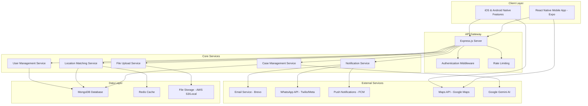

# Design Document

## Overview

The Animal Rescue Platform is a mobile-first application built with React Native (Expo) frontend and Node.js/Express backend, designed to facilitate rapid response to animal emergencies in India. The system uses geospatial matching to connect reporters with nearby volunteers and NGOs, implements real-time notifications, and provides native mobile features for field use including camera integration, GPS location, and offline capabilities.

## Architecture

### System Architecture



### Technology Stack

**Mobile Frontend:**
- React Native with Expo SDK 54
- React 19.1.0 for latest features
- React Native 0.81.5 for native capabilities
- Expo Camera for photo capture
- Expo Image Picker for gallery selection
- Expo Location for GPS services and reverse geocoding
- Expo Notifications for push notifications
- AsyncStorage for offline data persistence
- React Navigation for screen navigation
- React Native Maps for map display
- Native UI components (no external UI library needed)

**Backend:**
- Node.js with Express.js
- JavaScript with JSDoc for documentation
- JWT for authentication
- Multer for file uploads
- Socket.io for real-time communication

**Database:**
- MongoDB for primary data storage
- Redis for caching and session management
- Geospatial indexing for location queries

**External Services:**
- Cloudinary for image storage, optimization, and transformations
- Google Gemini AI for emergency assistance and recommendations
- Brevo for email notifications
- WhatsApp Business API for WhatsApp messaging
- Firebase Cloud Messaging for push notifications
- Expo Location for GPS and reverse geocoding (no Google Maps API needed)

## Components and Interfaces

### Core Components

#### 1. Case Management Component
**Purpose:** Handles animal rescue case lifecycle from creation to resolution

**Key Methods:**
- `createCase(caseData)` - Creates new rescue case
- `updateCaseStatus(caseId, status)` - Updates case progress
- `getCaseDetails(caseId)` - Retrieves case information
- `searchCases(filters)` - Searches cases by criteria
- `archiveCase(caseId)` - Archives resolved cases

#### 2. Location Matching Service
**Purpose:** Finds nearby volunteers and NGOs based on geospatial proximity

**Key Methods:**
- `findNearbyHelpers(location, radius)` - Locates helpers within radius
- `calculateDistance(point1, point2)` - Computes distance between coordinates
- `updateHelperLocation(helperId, location)` - Updates helper service area
- `getServiceAreas(helperId)` - Retrieves helper coverage zones
- `getCurrentLocation()` - Gets user's current GPS coordinates
- `searchLocationByLandmarks(landmarks)` - Finds location using landmark descriptions
- `reverseGeocode(coordinates)` - Converts coordinates to readable address
- `suggestNearbyLandmarks(coordinates)` - Suggests landmarks near current location

#### 3. Notification Service
**Purpose:** Manages multi-channel notifications to users

**Key Methods:**
- `sendEmergencyAlert(helpers, caseData)` - Sends urgent notifications via WhatsApp, email, and push
- `sendStatusUpdate(userId, message)` - Sends case updates via WhatsApp/email/push
- `sendWelcomeMessage(userId)` - Sends onboarding messages via WhatsApp
- `scheduleReminder(userId, message, delay)` - Schedules delayed notifications
- `sendWhatsAppMessage(phoneNumber, message, mediaUrl)` - Sends WhatsApp messages with optional media
- `sendStatusUpdateReminder(caseId, helperId)` - Sends 24-hour status update reminders
- `scheduleStatusReminders(caseId)` - Sets up automated reminder schedule

#### 5. AI Emergency Assistance Service
**Purpose:** Provides immediate AI-powered assistance when no volunteers respond

**Key Methods:**
- `checkResponseTimeout(caseId)` - Monitors case for volunteer response timeouts
- `activateEmergencyMode(caseId)` - Triggers AI assistance when no response
- `findNearestFacilities(location, animalType)` - Uses Gemini to find nearby facilities
- `generateEmergencyInstructions(caseData)` - Creates immediate care instructions
- `getTransportationOptions(location, destination)` - Suggests transport methods
- `provideRealTimeGuidance(caseId)` - Offers step-by-step assistance via chat

#### 4. User Management Service
**Purpose:** Handles user registration, authentication, and profile management

**Key Methods:**
- `registerUser(userData)` - Creates new user account
- `authenticateUser(credentials)` - Validates user login
- `updateProfile(userId, profileData)` - Updates user information
- `verifyNGO(ngoId, documents)` - Verifies NGO registration documents and location
- `verifyVolunteer(volunteerId, documents)` - Verifies volunteer government ID and details
- `uploadVerificationDocuments(userId, documents)` - Handles document uploads
- `reviewVerificationStatus(userId)` - Admin review of verification documents
- `deactivateUser(userId)` - Deactivates user account

### API Endpoints

#### Case Management
- `POST /api/cases` - Create new case
- `GET /api/cases/:id` - Get case details
- `PATCH /api/cases/:id/status` - Update case status with mandatory photos
- `GET /api/cases/search` - Search cases
- `POST /api/cases/:id/messages` - Add case message
- `POST /api/cases/:id/status-update` - Submit status update with photos
- `GET /api/cases/:id/status-history` - Get case status update history
- `POST /api/cases/:id/reminder-acknowledge` - Acknowledge status update reminder

#### User Management
- `POST /api/auth/register` - User registration
- `POST /api/auth/login` - User login
- `GET /api/users/profile` - Get user profile
- `PATCH /api/users/profile` - Update profile
- `POST /api/users/verify-ngo` - Submit NGO verification documents
- `POST /api/users/verify-volunteer` - Submit volunteer verification documents
- `POST /api/users/upload-documents` - Upload verification documents
- `GET /api/users/verification-status` - Check verification status
- `PATCH /api/admin/verify-user/:id` - Admin approve/reject verification

#### Location Services
- `GET /api/location/helpers` - Find nearby helpers
- `PATCH /api/location/update` - Update user location
- `GET /api/location/service-areas` - Get service areas
- `POST /api/location/current` - Get current GPS location
- `POST /api/location/search-landmarks` - Search location by landmarks
- `GET /api/location/reverse-geocode` - Convert coordinates to address
- `GET /api/location/nearby-landmarks` - Get landmarks near coordinates

#### Notifications
- `POST /api/notifications/whatsapp` - Send WhatsApp message
- `GET /api/notifications/preferences` - Get notification preferences
- `PATCH /api/notifications/preferences` - Update notification preferences

#### AI Emergency Assistance
- `POST /api/ai/emergency-activate` - Activate AI assistance for case
- `GET /api/ai/nearest-facilities` - Get nearest animal hospitals/NGOs
- `POST /api/ai/emergency-instructions` - Get immediate care instructions
- `GET /api/ai/transportation-options` - Get transport suggestions
- `POST /api/ai/chat` - Real-time AI guidance chat

## Data Models

### Case Model
```javascript
/**
 * @typedef {Object} Case
 * @property {ObjectId} _id - Unique case identifier
 * @property {ObjectId} reporterId - ID of user who reported the case
 * @property {string} animalType - Type of animal (dog, cat, bird, etc.)
 * @property {string} condition - Current condition of the animal
 * @property {string} description - Detailed description of the situation
 * @property {Object} location - Location information
 * @property {number[]} [location.coordinates] - [longitude, latitude] (optional if GPS unavailable)
 * @property {string} [location.address] - Street address (optional)
 * @property {string} location.landmarks - Nearby landmarks (always required)
 * @property {string} location.description - Detailed location description
 * @property {boolean} location.isApproximate - Whether location is approximate/uncertain
 * @property {string} [location.nearestKnownPlace] - Nearest known place/area
 * @property {string} [location.directions] - Directions from nearest landmark
 * @property {string[]} photos - Array of photo URLs
 * @property {Object} contactInfo - Reporter contact information
 * @property {string} contactInfo.phone - Phone number
 * @property {string} [contactInfo.email] - Email address (optional)
 * @property {string} status - Case status: 'open', 'assigned', 'in_progress', 'resolved', 'closed'
 * @property {ObjectId[]} assignedHelpers - Array of helper IDs assigned to case
 * @property {Message[]} messages - Array of case messages
 * @property {StatusUpdate[]} statusUpdates - Array of status updates with photos
 * @property {Date} createdAt - Case creation timestamp
 * @property {Date} updatedAt - Last update timestamp
 * @property {Date} [resolvedAt] - Resolution timestamp (optional)
 * @property {Date} lastStatusUpdate - Timestamp of last status update
 * @property {Date} nextReminderDue - When next reminder should be sent
 * @property {boolean} reminderSent - Whether 24-hour reminder has been sent
 * @property {string} urgencyLevel - Urgency: 'low', 'medium', 'high', 'critical'
 */
```

### User Model
```javascript
/**
 * @typedef {Object} User
 * @property {ObjectId} _id - Unique user identifier
 * @property {string} email - User email address
 * @property {string} phone - User phone number
 * @property {string} name - User full name
 * @property {string} userType - User type: 'reporter', 'volunteer', 'ngo', 'admin'
 * @property {Object} profile - User profile information
 * @property {string} [profile.organization] - Organization name (optional)
 * @property {ServiceArea[]} profile.serviceAreas - Areas where user provides service
 * @property {string[]} profile.animalTypes - Types of animals user can help with
 * @property {Object} profile.verification - Verification status and documents
 * @property {string} profile.verification.status - 'pending', 'approved', 'rejected', 'not_submitted'
 * @property {Object} [profile.verification.documents] - Uploaded verification documents
 * @property {string[]} [profile.verification.documents.ngoRegistration] - NGO registration documents
 * @property {string} [profile.verification.documents.ngoLocation] - NGO location proof document
 * @property {string} [profile.verification.documents.governmentId] - Government ID for volunteers
 * @property {string} [profile.verification.documents.photo] - Profile photo
 * @property {Date} [profile.verification.submittedAt] - Document submission timestamp
 * @property {Date} [profile.verification.reviewedAt] - Admin review timestamp
 * @property {string} [profile.verification.reviewNotes] - Admin review comments
 * @property {Object} notificationPreferences - Notification settings
 * @property {boolean} notificationPreferences.whatsapp - WhatsApp notifications enabled
 * @property {boolean} notificationPreferences.email - Email notifications enabled
 * @property {boolean} notificationPreferences.push - Push notifications enabled
 * @property {number} notificationPreferences.radius - Service radius in kilometers
 * @property {Object} [location] - User location (optional)
 * @property {number[]} [location.coordinates] - [longitude, latitude]
 * @property {Date} [location.lastUpdated] - Last location update
 * @property {Date} createdAt - Account creation timestamp
 * @property {boolean} isActive - Whether account is active
 */
```

### Service Area Model
```javascript
/**
 * @typedef {Object} ServiceArea
 * @property {ObjectId} _id - Unique service area identifier
 * @property {ObjectId} helperId - ID of helper who serves this area
 * @property {Object} location - Location and coverage information
 * @property {number[]} location.coordinates - [longitude, latitude] center point
 * @property {number} location.radius - Service radius in kilometers
 * @property {string} city - City name
 * @property {string} state - State name
 * @property {boolean} isActive - Whether service area is active
 */
```

### Message Model
```javascript
/**
 * @typedef {Object} Message
 * @property {ObjectId} _id - Unique message identifier
 * @property {ObjectId} caseId - ID of associated case
 * @property {ObjectId} senderId - ID of message sender
 * @property {string} content - Message content
 * @property {string} messageType - Message type: 'text', 'status_update', 'system'
 * @property {string} priority - Message priority: 'normal', 'urgent'
 * @property {Date} timestamp - Message timestamp
 * @property {ObjectId[]} readBy - Array of user IDs who have read the message
 */
```

### Status Update Model
```javascript
/**
 * @typedef {Object} StatusUpdate
 * @property {ObjectId} _id - Unique status update identifier
 * @property {ObjectId} caseId - ID of associated case
 * @property {ObjectId} updatedBy - ID of user who provided the update
 * @property {string} previousStatus - Previous case status
 * @property {string} newStatus - New case status
 * @property {string} condition - Current condition of the animal
 * @property {string} description - Detailed update description
 * @property {string[]} photos - Array of photo URLs (minimum 2 required)
 * @property {Object} location - Current location of animal (if moved)
 * @property {number[]} [location.coordinates] - [longitude, latitude]
 * @property {string} [location.address] - Current address
 * @property {Date} timestamp - Update timestamp
 * @property {boolean} isScheduled - Whether this was a scheduled 24-hour update
 * @property {string} treatmentProvided - Description of treatment/care provided
 * @property {string} nextSteps - Planned next steps for the animal
 */
```

### Verification Requirements Model
```javascript
/**
 * @typedef {Object} VerificationRequirements
 * @property {Object} ngo - NGO verification requirements
 * @property {string[]} ngo.requiredDocuments - ['registration_certificate', 'location_proof', 'authorization_letter']
 * @property {Object} ngo.documentDetails - Document specifications
 * @property {string} ngo.documentDetails.registration_certificate - 'Government issued NGO registration certificate'
 * @property {string} ngo.documentDetails.location_proof - 'Document showing NGO physical address (lease/ownership proof)'
 * @property {string} ngo.documentDetails.authorization_letter - 'Letter authorizing person to represent NGO'
 * @property {Object} volunteer - Volunteer verification requirements
 * @property {string[]} volunteer.requiredDocuments - ['government_id', 'photo', 'address_proof']
 * @property {Object} volunteer.documentDetails - Document specifications
 * @property {string} volunteer.documentDetails.government_id - 'Aadhaar Card, PAN Card, Driving License, or Passport'
 * @property {string} volunteer.documentDetails.photo - 'Clear photo of the volunteer'
 * @property {string} volunteer.documentDetails.address_proof - 'Address proof matching government ID'
 */
```

## Error Handling

### Error Categories

1. **Validation Errors (400)**
   - Invalid input data
   - Missing required fields
   - Format validation failures

2. **Authentication Errors (401/403)**
   - Invalid credentials
   - Expired tokens
   - Insufficient permissions

3. **Resource Errors (404)**
   - Case not found
   - User not found
   - Invalid endpoints

4. **Service Errors (500)**
   - Database connection failures
   - External API failures
   - File upload failures

### Error Response Format
```javascript
/**
 * @typedef {Object} ErrorResponse
 * @property {boolean} success - Always false for error responses
 * @property {Object} error - Error details
 * @property {string} error.code - Error code
 * @property {string} error.message - Human-readable error message
 * @property {*} [error.details] - Additional error details (optional)
 * @property {Date} timestamp - Error timestamp
 * @property {string} requestId - Unique request identifier
 */
```

### Error Handling Strategy

- **Client-side:** React Error Boundaries for component errors, try-catch for API calls
- **Server-side:** Global error middleware, structured error logging
- **Database:** Connection retry logic, transaction rollbacks
- **External APIs:** Circuit breaker pattern, fallback mechanisms

## WhatsApp Integration

### WhatsApp Message Flow
1. **Emergency Alert:** When a case is reported, nearby volunteers and NGOs receive WhatsApp messages with:
   - Animal type and condition
   - Location with Google Maps link
   - Reporter contact information
   - Case ID for tracking
   - Photos of the animal (if available)

2. **Status Updates:** Case participants receive WhatsApp notifications for:
   - Case assignment confirmations
   - Status changes (in progress, resolved)
   - New messages in case chat
   - Urgent updates from other helpers

3. **Message Templates:**
   - Emergency alert template with structured data
   - Status update template
   - Welcome message for new users
   - Case resolution confirmation

### WhatsApp API Integration
- Uses WhatsApp Business API for reliable message delivery
- Supports text messages, images, and location sharing
- Implements message templates for consistent formatting
- Handles delivery status and read receipts
- Manages opt-in/opt-out preferences for users

## User Verification Process

### NGO Verification Requirements
**Mandatory Documents:**
1. **NGO Registration Certificate**
   - Government issued registration document
   - Must show NGO name, registration number, and validity
   - Document must be clear and legible

2. **Location Proof Document**
   - Lease agreement, property ownership document, or utility bill
   - Must show physical address of NGO operations
   - Address should match registration certificate

3. **Authorization Letter**
   - Letter on NGO letterhead authorizing the person to represent the organization
   - Must be signed by authorized NGO officials
   - Should include contact details for verification

**Verification Process:**
- Admin reviews all submitted documents
- Cross-verification of NGO registration with government databases
- Phone verification with provided contact numbers
- Approval/rejection with detailed feedback

### Volunteer Verification Requirements
**Mandatory Documents:**
1. **Government ID**
   - Aadhaar Card (preferred), PAN Card, Driving License, or Passport
   - Must be valid and not expired
   - Name, address, and phone number must be clearly visible

2. **Profile Photo**
   - Clear, recent photograph of the volunteer
   - Face should be clearly visible
   - Used for identity verification during rescue operations

3. **Address Proof**
   - Document confirming current address
   - Must match address on government ID
   - Utility bill, bank statement, or rental agreement

**Verification Process:**
- Automated validation of government ID format
- Manual review of document authenticity
- Address verification through cross-referencing
- Background check for serious criminal records (optional)
- Approval with verified badge on profile

### Verification Status Management
- **Not Submitted:** User registered but hasn't uploaded documents
- **Pending:** Documents uploaded, awaiting admin review
- **Approved:** All documents verified, user can receive case notifications
- **Rejected:** Documents rejected, user must resubmit with corrections
- **Suspended:** Verification revoked due to policy violations

## Animal Status Monitoring System

### Mandatory Status Updates
**Photo Requirements:**
- Every status change must include exactly 2 photos of the animal
- Photos must be clear and show the current condition
- Before and after photos for treatment updates
- Photos must be taken within 1 hour of status update submission

**24-Hour Update Rule:**
- Assigned helpers must provide status updates every 24 hours
- Updates required until case is marked as 'resolved' or 'closed'
- Automatic reminder system tracks update schedules
- Missed updates trigger escalation notifications

### Status Update Process
1. **Helper submits update with:**
   - Current animal condition description
   - 2 mandatory photos showing current state
   - Treatment provided (if any)
   - Next planned steps
   - Current location (if animal was moved)

2. **System automatically:**
   - Validates photo requirements (minimum 2 photos)
   - Updates case timeline
   - Notifies all case participants
   - Schedules next 24-hour reminder
   - Sends WhatsApp updates to reporter and other helpers

### Automated Reminder System
**Reminder Schedule:**
- First reminder: 20 hours after last update
- Second reminder: 24 hours after last update
- Escalation: 28 hours after last update (notifies admin and reporter)
- Final escalation: 36 hours (case flagged for review)

**Reminder Notifications:**
- WhatsApp message with case details and update link
- Email notification with photo upload instructions
- Push notification for mobile app users
- Escalation messages include case urgency and contact details

**Reminder Content:**
- Case ID and animal details
- Time since last update
- Direct link to update form
- Reminder of photo requirements
- Contact information for support

### Status Update Validation
**Required Fields:**
- Animal condition (dropdown: improving, stable, deteriorating, critical)
- Detailed description (minimum 50 characters)
- 2 photos (validated for quality and timestamp)
- Treatment provided (text field)
- Next steps planned (text field)

**Photo Validation:**
- File format: JPEG, PNG only
- Maximum file size: 5MB per photo
- Minimum resolution: 640x480 pixels
- EXIF data check for recent timestamp
- Automatic compression for storage

### Escalation Process
**Missed Update Escalation:**
1. **24+ hours:** Reminder to assigned helper
2. **28+ hours:** Notification to case reporter and admin
3. **36+ hours:** Case flagged for emergency review
4. **48+ hours:** Case reassigned to backup helpers in area
5. **72+ hours:** Admin intervention and potential helper suspension

## Location Assistance System

### Handling Unknown Locations
**When GPS is Available:**
- Automatic location detection using device GPS
- Reverse geocoding to get readable address
- Nearby landmark suggestions from Google Places API
- Option to manually adjust location if GPS is inaccurate

**When GPS is Unavailable or Inaccurate:**
- Landmark-based location reporting system
- Step-by-step location assistance wizard
- Photo-based location identification
- Crowdsourced location verification

### Location Reporting Options

#### Option 1: GPS + Manual Verification
1. **Auto-detect location** using device GPS
2. **Show detected address** and nearby landmarks
3. **Allow user to confirm or adjust** the location
4. **Add additional landmarks** for better identification

#### Option 2: Landmark-Based Reporting
1. **Ask for nearest known place** (hospital, school, market, etc.)
2. **Request specific landmarks** (shops, buildings, signs)
3. **Get directional information** (distance and direction from landmark)
4. **Collect visual references** (photos of surroundings)

#### Option 3: Assisted Location Finding
1. **Progressive questioning system:**
   - "What city/area are you in?"
   - "What's the nearest main road or highway?"
   - "What shops or buildings do you see nearby?"
   - "Can you describe any signs or landmarks?"

2. **Photo assistance:**
   - "Take a photo of nearby street signs"
   - "Photo of any shop names or building numbers"
   - "Wide shot showing the general area"

### Location Verification Process

**For Uncertain Locations:**
1. **Multiple confirmation methods:**
   - Cross-reference landmark descriptions with map data
   - Use photos to identify location through image recognition
   - Crowdsource verification from local helpers
   - Phone verification with reporter for clarification

2. **Helper assistance:**
   - Nearby helpers can help identify exact location
   - Local volunteers familiar with area landmarks
   - Real-time communication to refine location details

### Smart Location Features

**Landmark Database:**
- Maintain database of common landmarks in Indian cities
- Hospitals, schools, temples, markets, bus stops
- User-contributed landmark additions
- Photo verification of landmark accuracy

**Location Suggestions:**
- AI-powered location suggestions based on description
- Pattern matching with previous case locations
- Integration with Google Places and local directories
- Crowdsourced location database from verified users

**Progressive Location Refinement:**
1. **Initial report** with best available location information
2. **Helper verification** when they arrive at approximate area
3. **Location updates** as more precise information becomes available
4. **Final confirmation** when animal is found and secured

### Mobile Location Features

**Offline Capability:**
- Cache location data for offline use
- Store landmark database locally
- Queue location updates for when connection returns
- GPS coordinate logging even without internet

**Camera Integration:**
- Photo-based location identification
- Automatic landmark detection in photos
- GPS coordinates embedded in photo metadata
- Visual location confirmation system

**Voice Input:**
- Voice-to-text for landmark descriptions
- Multi-language support (Hindi, English, regional languages)
- Audio recording for complex location descriptions
- Hands-free reporting while handling injured animal

## AI Emergency Assistance System

### Automatic Activation Triggers
**No Volunteer Response Scenarios:**
- No helper responds within 15 minutes during daytime (6 AM - 10 PM)
- No helper responds within 30 minutes during nighttime (10 PM - 6 AM)
- All nearby helpers decline the case
- Critical urgency cases with no immediate response
- Remote areas with no registered volunteers

### Google Gemini AI Integration

#### Immediate Facility Recommendations
**AI analyzes case data and provides:**
1. **Nearest Animal Hospitals:**
   - Name, address, and contact details
   - Distance and estimated travel time
   - Specializations (small animals, large animals, wildlife)
   - Operating hours and emergency availability
   - User reviews and ratings

2. **Nearby NGOs and Shelters:**
   - Active animal rescue organizations
   - Contact information and WhatsApp numbers
   - Services offered (rescue, treatment, shelter)
   - Capacity and current availability
   - Volunteer coordinator details

3. **Veterinary Clinics:**
   - 24/7 emergency clinics
   - Specialized wildlife veterinarians
   - Mobile veterinary services
   - Government veterinary hospitals
   - Cost estimates for treatment

#### Real-Time AI Guidance Chat
**Interactive assistance through Gemini:**
- **Immediate Care Instructions:** First aid steps based on animal type and condition
- **Safety Guidance:** How to safely handle injured animals
- **Transportation Advice:** Best methods to transport the animal
- **Documentation Help:** What photos/information to collect
- **Emergency Contacts:** Direct numbers for immediate help

#### Smart Recommendations Engine
**AI considers multiple factors:**
- Animal type and severity of injury
- User's current location and transportation options
- Time of day and facility availability
- User's experience level with animal handling
- Local language preferences for communication

### Emergency Response Workflow

#### Phase 1: Immediate Assessment (0-5 minutes)
1. **AI analyzes case details:**
   - Animal type, condition, and photos
   - Location and accessibility
   - Time of day and urgency level

2. **Provides instant recommendations:**
   - Immediate first aid instructions
   - Safety precautions for the user
   - Whether to move the animal or wait for help

#### Phase 2: Facility Identification (5-10 minutes)
1. **Searches comprehensive database:**
   - Government veterinary hospitals
   - Private animal hospitals
   - NGO rescue centers
   - Wildlife rehabilitation centers

2. **Ranks options by:**
   - Distance and travel time
   - Facility capabilities for the specific animal
   - Current availability and operating hours
   - Cost considerations

#### Phase 3: Action Plan Generation (10-15 minutes)
1. **Creates step-by-step plan:**
   - Immediate care instructions
   - Transportation arrangements
   - Contact sequence (who to call first)
   - Required documents or information

2. **Provides backup options:**
   - Alternative facilities if first choice unavailable
   - Multiple transportation methods
   - Emergency contact escalation sequence

### AI-Powered Features

#### Intelligent Facility Database
**Continuously updated information:**
- Real-time facility availability
- Crowdsourced reviews and experiences
- Integration with Google Maps and Places API
- Government veterinary hospital directories
- NGO registration databases

#### Multi-Language Support
**AI communicates in:**
- Hindi and English (primary)
- Regional languages based on location
- Simple, clear instructions for emergency situations
- Voice output for hands-free guidance

#### Photo Analysis
**AI analyzes animal photos to:**
- Assess injury severity
- Identify animal species
- Recommend appropriate treatment facilities
- Suggest immediate care measures
- Determine transportation requirements

### Emergency Contact Integration

#### Direct Communication Channels
**AI facilitates immediate contact:**
- Auto-dial nearest facility with case details
- WhatsApp message templates for quick communication
- SMS alerts to facility emergency numbers
- Email with case summary and photos

#### Escalation Protocols
**If primary options fail:**
1. **Government helplines:** Animal welfare board numbers
2. **Police assistance:** For wildlife or dangerous situations
3. **Fire department:** For rescue operations
4. **Municipal services:** For stray animal emergencies

### Success Tracking and Learning

#### Outcome Monitoring
**AI tracks and learns from:**
- Response times of different facilities
- Success rates of recommendations
- User feedback on AI guidance quality
- Facility availability patterns

#### Continuous Improvement
**System enhancement through:**
- Machine learning from case outcomes
- User feedback integration
- Facility performance analytics
- Regional pattern recognition

### User Interface for AI Assistance

#### Emergency Mode Activation
**Clear visual indicators:**
- Red "Emergency AI Assistance" banner
- Step-by-step guidance interface
- One-tap calling for recommended facilities
- Real-time chat with AI assistant

#### Simplified Decision Making
**AI presents options as:**
- "Call Now" buttons for immediate contact
- "Get Directions" for navigation to facilities
- "Emergency Instructions" for immediate care
- "Alternative Options" for backup plans

## Testing Strategy

### Unit Testing
- **Backend:** Jest for service layer testing, Supertest for API testing
- **Frontend:** Jest + React Testing Library for component testing
- **Coverage Target:** 80% code coverage minimum

### Integration Testing
- **API Integration:** Test complete request/response cycles
- **Database Integration:** Test data persistence and retrieval
- **External Service Integration:** Mock external APIs for testing

### End-to-End Testing
- **User Flows:** Cypress for critical user journeys
- **Mobile Testing:** Test responsive design and PWA features
- **Performance Testing:** Load testing with Artillery

### Test Scenarios
1. **Case Creation Flow:** Reporter creates case → Helpers receive WhatsApp notifications → Case gets assigned
2. **No Response Scenario:** No volunteers respond → AI emergency assistance activates → User gets facility recommendations
3. **Location Matching:** Verify accurate distance calculations and helper selection
4. **Unknown Location Handling:** Test landmark-based reporting, photo assistance, and location verification
5. **AI Emergency Assistance:** Test Gemini integration, facility recommendations, and real-time guidance
6. **WhatsApp Integration:** Test message delivery, media sharing, and delivery status
7. **Status Update System:** Test mandatory photo uploads, 24-hour reminders, and escalation process
8. **Real-time Communication:** Test message delivery and status updates across all channels
9. **Mobile Experience:** Test camera integration, GPS, offline capabilities, and voice input
10. **NGO Verification:** Test credential upload and verification workflow
11. **Reminder System:** Test automated reminders and escalation notifications
12. **Location Assistance:** Test GPS fallback, landmark suggestions, and crowdsourced verification

### Testing Environment
- **Development:** Local MongoDB and Redis instances
- **Staging:** Cloud-based testing environment with production-like data
- **Production:** Monitoring and alerting for real-time issue detection