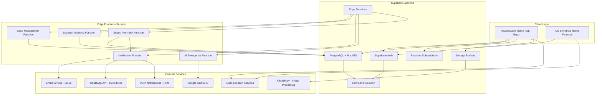

# Design Document

## Overview

The Animal Rescue Platform is a mobile-first application built with React Native (Expo) frontend and Supabase backend, designed to facilitate rapid response to animal emergencies in India. The system uses Supabase's PostgreSQL with PostGIS for geospatial matching to connect reporters with nearby volunteers and NGOs, implements real-time subscriptions for live updates, and provides native mobile features for field use including camera integration, GPS location, and offline capabilities. Supabase provides authentication, database, storage, real-time subscriptions, and edge functions in a unified platform.

## Architecture

### System Architecture


```mermaid
graph TB
    subgraph "Client Layer"
        A[React Native Mobile App - Expo]
        B[iOS & Android Native Features]
    end
    
    subgraph "Supabase Backend"
        C[Supabase Auth]
        D[PostgreSQL + PostGIS]
        E[Realtime Subscriptions]
        F[Storage Buckets]
        G[Edge Functions]
        H[Row Level Security]
    end
    
    subgraph "Edge Functions Services"
        I[Case Management Function]
        J[Location Matching Function]
        K[Notification Function]
        L[AI Emergency Function]
        M[Status Reminder Function]
    end
    
    subgraph "External Services"
        N[Email Service - Brevo]
        O[WhatsApp API - Twilio/Meta]
        P[Push Notifications - FCM]
        Q[Expo Location Services]
        R[Google Gemini AI]
        S[Cloudinary - Image Processing]
    end
    
    A --> C
    A --> D
    A --> E
    A --> F
    B --> C
    C --> H
    D --> H
    G --> I
    G --> J
    G --> K
    G --> L
    G --> M
    I --> D
    J --> D
    K --> N
    K --> O
    K --> P
    L --> R
    M --> D
    M --> K
    A --> Q
    B --> Q
    F --> S
```

### Technology Stack

**Mobile Frontend:**
- React Native with Expo SDK 54
- React 19.1.0 for latest features
- React Native 0.81.5 for native capabilities
- Expo Camera for photo capture
- Expo Image Picker for gallery selection
- Expo Location for GPS services and reverse geocoding
- Expo Notifications for push notifications
- AsyncStorage for offline data persistence
- React Navigation for screen navigation
- React Native Maps for map display
- Native UI components (no external UI library needed)
- Supabase JS Client (@supabase/supabase-js) for backend integration

**Backend (Supabase):**
- **Database:** PostgreSQL 15+ with PostGIS extension for geospatial queries
- **Authentication:** Supabase Auth with JWT tokens, social providers, and magic links
- **Real-time:** Supabase Realtime for live data subscriptions via WebSockets
- **Storage:** Supabase Storage for file uploads with automatic image optimization
- **Edge Functions:** Deno-based serverless functions for business logic
- **Row Level Security (RLS):** Database-level security policies for data access control

**Edge Functions (Deno/TypeScript):**
- Case management and workflow automation
- Location-based matching with PostGIS queries
- Multi-channel notification orchestration
- AI emergency assistance integration
- Automated status reminder scheduling
- WhatsApp and email integration

**External Services:**
- Cloudinary for advanced image processing and transformations
- Google Gemini AI for emergency assistance and recommendations
- Brevo for email notifications
- WhatsApp Business API for WhatsApp messaging
- Firebase Cloud Messaging for push notifications
- Expo Location for GPS and reverse geocoding

## Components and Interfaces

### Core Components

#### 1. Case Management Component
**Purpose:** Handles animal rescue case lifecycle from creation to resolution

**Key Methods:**
- `createCase(caseData)` - Creates new rescue case
- `updateCaseStatus(caseId, status)` - Updates case progress
- `getCaseDetails(caseId)` - Retrieves case information
- `searchCases(filters)` - Searches cases by criteria
- `archiveCase(caseId)` - Archives resolved cases

#### 2. Location Matching Service
**Purpose:** Finds nearby volunteers and NGOs based on geospatial proximity

**Key Methods:**
- `findNearbyHelpers(location, radius)` - Locates helpers within radius
- `calculateDistance(point1, point2)` - Computes distance between coordinates
- `updateHelperLocation(helperId, location)` - Updates helper service area
- `getServiceAreas(helperId)` - Retrieves helper coverage zones
- `getCurrentLocation()` - Gets user's current GPS coordinates
- `searchLocationByLandmarks(landmarks)` - Finds location using landmark descriptions
- `reverseGeocode(coordinates)` - Converts coordinates to readable address
- `suggestNearbyLandmarks(coordinates)` - Suggests landmarks near current location

#### 3. Notification Service
**Purpose:** Manages multi-channel notifications to users

**Key Methods:**
- `sendEmergencyAlert(helpers, caseData)` - Sends urgent notifications via WhatsApp, email, and push
- `sendStatusUpdate(userId, message)` - Sends case updates via WhatsApp/email/push
- `sendWelcomeMessage(userId)` - Sends onboarding messages via WhatsApp
- `scheduleReminder(userId, message, delay)` - Schedules delayed notifications
- `sendWhatsAppMessage(phoneNumber, message, mediaUrl)` - Sends WhatsApp messages with optional media
- `sendStatusUpdateReminder(caseId, helperId)` - Sends 24-hour status update reminders
- `scheduleStatusReminders(caseId)` - Sets up automated reminder schedule

#### 5. AI Emergency Assistance Service
**Purpose:** Provides immediate AI-powered assistance when no volunteers respond

**Key Methods:**
- `checkResponseTimeout(caseId)` - Monitors case for volunteer response timeouts
- `activateEmergencyMode(caseId)` - Triggers AI assistance when no response
- `findNearestFacilities(location, animalType)` - Uses Gemini to find nearby facilities
- `generateEmergencyInstructions(caseData)` - Creates immediate care instructions
- `getTransportationOptions(location, destination)` - Suggests transport methods
- `provideRealTimeGuidance(caseId)` - Offers step-by-step assistance via chat

#### 4. User Management Service
**Purpose:** Handles user registration, authentication, and profile management

**Key Methods:**
- `registerUser(userData)` - Creates new user account
- `authenticateUser(credentials)` - Validates user login
- `updateProfile(userId, profileData)` - Updates user information
- `verifyNGO(ngoId, documents)` - Verifies NGO registration documents and location
- `verifyVolunteer(volunteerId, documents)` - Verifies volunteer government ID and details
- `uploadVerificationDocuments(userId, documents)` - Handles document uploads
- `reviewVerificationStatus(userId)` - Admin review of verification documents
- `deactivateUser(userId)` - Deactivates user account

### Data Access Patterns

#### Direct Database Access (via Supabase Client)
**Cases:**
- `supabase.from('cases').insert()` - Create new case
- `supabase.from('cases').select().eq('id', caseId)` - Get case details
- `supabase.from('cases').update().eq('id', caseId)` - Update case
- `supabase.from('cases').select().match(filters)` - Search cases with filters
- `supabase.from('cases').select('*, messages(*)')` - Get case with messages (join)

**Users & Profiles:**
- `supabase.auth.signUp()` - User registration with Supabase Auth
- `supabase.auth.signInWithPassword()` - User login
- `supabase.from('profiles').select()` - Get user profile
- `supabase.from('profiles').update()` - Update profile
- `supabase.from('verification_documents').insert()` - Upload verification docs

**Location Queries (PostGIS):**
- `supabase.rpc('find_nearby_helpers', { lat, lng, radius })` - Find helpers within radius using PostGIS
- `supabase.from('service_areas').select()` - Get service areas
- `supabase.rpc('calculate_distance', { point1, point2 })` - Calculate distance

**Real-time Subscriptions:**
- `supabase.channel('cases').on('postgres_changes', { event: 'INSERT', schema: 'public', table: 'cases' })` - Subscribe to new cases
- `supabase.channel('messages').on('postgres_changes', { event: 'INSERT', schema: 'public', table: 'messages' })` - Subscribe to new messages
- `supabase.channel('status_updates').on('postgres_changes')` - Subscribe to status updates

**Storage Operations:**
- `supabase.storage.from('case-photos').upload()` - Upload case photos
- `supabase.storage.from('verification-docs').upload()` - Upload verification documents
- `supabase.storage.from('status-photos').upload()` - Upload status update photos

#### Edge Functions (Supabase Functions)
**Case Management:**
- `POST /functions/v1/case-workflow` - Handle case creation workflow and notifications
- `POST /functions/v1/assign-helper` - Assign helper to case
- `POST /functions/v1/update-case-status` - Update case status with validation

**Location Services:**
- `POST /functions/v1/match-helpers` - Complex location matching with business logic
- `POST /functions/v1/geocode-landmarks` - Landmark-based location resolution

**Notifications:**
- `POST /functions/v1/send-notifications` - Multi-channel notification orchestration
- `POST /functions/v1/whatsapp-webhook` - WhatsApp webhook handler
- `POST /functions/v1/schedule-reminders` - Schedule status update reminders

**AI Emergency:**
- `POST /functions/v1/ai-emergency` - Activate AI emergency assistance
- `POST /functions/v1/ai-chat` - AI guidance chat endpoint
- `POST /functions/v1/find-facilities` - AI-powered facility search

**Admin & Verification:**
- `POST /functions/v1/verify-user` - Admin verification workflow
- `POST /functions/v1/moderate-content` - Content moderation

**Scheduled Functions (via pg_cron):**
- `check_status_reminders()` - Runs every hour to check for overdue status updates
- `send_reminder_notifications()` - Sends reminder notifications for pending updates
- `escalate_overdue_cases()` - Escalates cases with missed updates

## Data Models (PostgreSQL Schema)

### Cases Table
```sql
CREATE TABLE cases (
  id UUID PRIMARY KEY DEFAULT gen_random_uuid(),
  reporter_id UUID NOT NULL REFERENCES auth.users(id),
  animal_type VARCHAR(50) NOT NULL,
  condition VARCHAR(100) NOT NULL,
  description TEXT NOT NULL,
  
  -- Location using PostGIS geometry type
  location_point GEOGRAPHY(POINT, 4326), -- Optional if GPS unavailable
  location_address TEXT,
  location_landmarks TEXT NOT NULL, -- Always required
  location_description TEXT NOT NULL,
  location_is_approximate BOOLEAN DEFAULT false,
  location_nearest_place TEXT,
  location_directions TEXT,
  
  -- Contact info stored as JSONB
  contact_info JSONB NOT NULL, -- {phone: string, email?: string}
  
  -- Photos stored as array of storage URLs
  photos TEXT[] DEFAULT '{}',
  
  -- Status and workflow
  status VARCHAR(20) NOT NULL DEFAULT 'open' CHECK (status IN ('open', 'assigned', 'in_progress', 'resolved', 'closed')),
  urgency_level VARCHAR(20) DEFAULT 'medium' CHECK (urgency_level IN ('low', 'medium', 'high', 'critical')),
  
  -- Timestamps
  created_at TIMESTAMPTZ DEFAULT NOW(),
  updated_at TIMESTAMPTZ DEFAULT NOW(),
  resolved_at TIMESTAMPTZ,
  last_status_update TIMESTAMPTZ DEFAULT NOW(),
  next_reminder_due TIMESTAMPTZ,
  reminder_sent BOOLEAN DEFAULT false,
  
  -- Indexes for performance
  CONSTRAINT valid_contact_info CHECK (contact_info ? 'phone')
);

-- PostGIS spatial index for location queries
CREATE INDEX idx_cases_location ON cases USING GIST(location_point);
CREATE INDEX idx_cases_status ON cases(status);
CREATE INDEX idx_cases_created_at ON cases(created_at DESC);
CREATE INDEX idx_cases_reporter ON cases(reporter_id);
```

### Profiles Table (extends auth.users)
```sql
CREATE TABLE profiles (
  id UUID PRIMARY KEY REFERENCES auth.users(id) ON DELETE CASCADE,
  email TEXT NOT NULL,
  phone TEXT NOT NULL,
  name TEXT NOT NULL,
  user_type VARCHAR(20) NOT NULL CHECK (user_type IN ('reporter', 'volunteer', 'ngo', 'admin')),
  
  -- Profile information
  organization TEXT,
  animal_types TEXT[] DEFAULT '{}',
  
  -- Verification stored as JSONB
  verification JSONB DEFAULT '{
    "status": "not_submitted",
    "documents": {},
    "submittedAt": null,
    "reviewedAt": null,
    "reviewNotes": null
  }'::jsonb,
  
  -- Notification preferences as JSONB
  notification_preferences JSONB DEFAULT '{
    "whatsapp": true,
    "email": true,
    "push": true,
    "radius": 10
  }'::jsonb,
  
  -- Current location using PostGIS
  current_location GEOGRAPHY(POINT, 4326),
  location_updated_at TIMESTAMPTZ,
  
  -- Metadata
  created_at TIMESTAMPTZ DEFAULT NOW(),
  is_active BOOLEAN DEFAULT true,
  
  CONSTRAINT valid_verification CHECK (verification->>'status' IN ('not_submitted', 'pending', 'approved', 'rejected'))
);

CREATE INDEX idx_profiles_user_type ON profiles(user_type);
CREATE INDEX idx_profiles_location ON profiles USING GIST(current_location);
CREATE INDEX idx_profiles_verification_status ON profiles((verification->>'status'));
```

### Service Areas Table
```sql
CREATE TABLE service_areas (
  id UUID PRIMARY KEY DEFAULT gen_random_uuid(),
  helper_id UUID NOT NULL REFERENCES profiles(id) ON DELETE CASCADE,
  
  -- Location using PostGIS
  center_point GEOGRAPHY(POINT, 4326) NOT NULL,
  radius_km NUMERIC(5,2) NOT NULL,
  
  -- Geographic info
  city TEXT NOT NULL,
  state TEXT NOT NULL,
  
  -- Status
  is_active BOOLEAN DEFAULT true,
  created_at TIMESTAMPTZ DEFAULT NOW(),
  
  CONSTRAINT positive_radius CHECK (radius_km > 0)
);

CREATE INDEX idx_service_areas_helper ON service_areas(helper_id);
CREATE INDEX idx_service_areas_location ON service_areas USING GIST(center_point);
CREATE INDEX idx_service_areas_active ON service_areas(is_active) WHERE is_active = true;
```

### Messages Table
```sql
CREATE TABLE messages (
  id UUID PRIMARY KEY DEFAULT gen_random_uuid(),
  case_id UUID NOT NULL REFERENCES cases(id) ON DELETE CASCADE,
  sender_id UUID NOT NULL REFERENCES profiles(id),
  
  content TEXT NOT NULL,
  message_type VARCHAR(20) DEFAULT 'text' CHECK (message_type IN ('text', 'status_update', 'system')),
  priority VARCHAR(20) DEFAULT 'normal' CHECK (priority IN ('normal', 'urgent')),
  
  timestamp TIMESTAMPTZ DEFAULT NOW(),
  read_by UUID[] DEFAULT '{}',
  
  CONSTRAINT non_empty_content CHECK (LENGTH(content) > 0)
);

CREATE INDEX idx_messages_case ON messages(case_id, timestamp DESC);
CREATE INDEX idx_messages_sender ON messages(sender_id);
CREATE INDEX idx_messages_timestamp ON messages(timestamp DESC);
```

### Status Updates Table
```sql
CREATE TABLE status_updates (
  id UUID PRIMARY KEY DEFAULT gen_random_uuid(),
  case_id UUID NOT NULL REFERENCES cases(id) ON DELETE CASCADE,
  updated_by UUID NOT NULL REFERENCES profiles(id),
  
  previous_status VARCHAR(20) NOT NULL,
  new_status VARCHAR(20) NOT NULL,
  condition VARCHAR(100) NOT NULL,
  description TEXT NOT NULL,
  
  -- Photos (minimum 2 required)
  photos TEXT[] NOT NULL,
  
  -- Current location if animal moved
  current_location GEOGRAPHY(POINT, 4326),
  current_address TEXT,
  
  timestamp TIMESTAMPTZ DEFAULT NOW(),
  is_scheduled BOOLEAN DEFAULT false,
  
  treatment_provided TEXT NOT NULL,
  next_steps TEXT NOT NULL,
  
  CONSTRAINT minimum_photos CHECK (array_length(photos, 1) >= 2),
  CONSTRAINT non_empty_description CHECK (LENGTH(description) >= 50)
);

CREATE INDEX idx_status_updates_case ON status_updates(case_id, timestamp DESC);
CREATE INDEX idx_status_updates_user ON status_updates(updated_by);
```

### Case Assignments Table (Junction Table)
```sql
CREATE TABLE case_assignments (
  id UUID PRIMARY KEY DEFAULT gen_random_uuid(),
  case_id UUID NOT NULL REFERENCES cases(id) ON DELETE CASCADE,
  helper_id UUID NOT NULL REFERENCES profiles(id) ON DELETE CASCADE,
  
  assigned_at TIMESTAMPTZ DEFAULT NOW(),
  accepted_at TIMESTAMPTZ,
  status VARCHAR(20) DEFAULT 'pending' CHECK (status IN ('pending', 'accepted', 'declined', 'completed')),
  
  UNIQUE(case_id, helper_id)
);

CREATE INDEX idx_case_assignments_case ON case_assignments(case_id);
CREATE INDEX idx_case_assignments_helper ON case_assignments(helper_id);
```

### Verification Documents Table
```sql
CREATE TABLE verification_documents (
  id UUID PRIMARY KEY DEFAULT gen_random_uuid(),
  user_id UUID NOT NULL REFERENCES profiles(id) ON DELETE CASCADE,
  
  document_type VARCHAR(50) NOT NULL CHECK (document_type IN (
    'registration_certificate', 
    'location_proof', 
    'authorization_letter',
    'government_id',
    'photo',
    'address_proof'
  )),
  
  file_url TEXT NOT NULL,
  file_name TEXT NOT NULL,
  file_size INTEGER NOT NULL,
  mime_type TEXT NOT NULL,
  
  uploaded_at TIMESTAMPTZ DEFAULT NOW(),
  verified_at TIMESTAMPTZ,
  verified_by UUID REFERENCES profiles(id),
  verification_status VARCHAR(20) DEFAULT 'pending' CHECK (verification_status IN ('pending', 'approved', 'rejected')),
  verification_notes TEXT
);

CREATE INDEX idx_verification_docs_user ON verification_documents(user_id);
CREATE INDEX idx_verification_docs_status ON verification_documents(verification_status);
```

### PostGIS Functions for Geospatial Queries

```sql
-- Find helpers within radius of a location
CREATE OR REPLACE FUNCTION find_nearby_helpers(
  lat NUMERIC,
  lng NUMERIC,
  radius_km NUMERIC DEFAULT 10
)
RETURNS TABLE (
  helper_id UUID,
  name TEXT,
  user_type VARCHAR(20),
  distance_km NUMERIC,
  phone TEXT,
  notification_preferences JSONB
) AS $$
BEGIN
  RETURN QUERY
  SELECT 
    p.id,
    p.name,
    p.user_type,
    ROUND(ST_Distance(
      p.current_location,
      ST_SetSRID(ST_MakePoint(lng, lat), 4326)::geography
    ) / 1000, 2) as distance_km,
    p.phone,
    p.notification_preferences
  FROM profiles p
  WHERE 
    p.user_type IN ('volunteer', 'ngo')
    AND p.is_active = true
    AND p.verification->>'status' = 'approved'
    AND ST_DWithin(
      p.current_location,
      ST_SetSRID(ST_MakePoint(lng, lat), 4326)::geography,
      radius_km * 1000
    )
  ORDER BY distance_km ASC;
END;
$$ LANGUAGE plpgsql;

-- Calculate distance between two points
CREATE OR REPLACE FUNCTION calculate_distance(
  lat1 NUMERIC,
  lng1 NUMERIC,
  lat2 NUMERIC,
  lng2 NUMERIC
)
RETURNS NUMERIC AS $$
BEGIN
  RETURN ROUND(ST_Distance(
    ST_SetSRID(ST_MakePoint(lng1, lat1), 4326)::geography,
    ST_SetSRID(ST_MakePoint(lng2, lat2), 4326)::geography
  ) / 1000, 2);
END;
$$ LANGUAGE plpgsql;

-- Check if point is within service area
CREATE OR REPLACE FUNCTION is_within_service_area(
  helper_id UUID,
  lat NUMERIC,
  lng NUMERIC
)
RETURNS BOOLEAN AS $$
DECLARE
  is_within BOOLEAN;
BEGIN
  SELECT EXISTS(
    SELECT 1
    FROM service_areas sa
    WHERE 
      sa.helper_id = is_within_service_area.helper_id
      AND sa.is_active = true
      AND ST_DWithin(
        sa.center_point,
        ST_SetSRID(ST_MakePoint(lng, lat), 4326)::geography,
        sa.radius_km * 1000
      )
  ) INTO is_within;
  
  RETURN is_within;
END;
$$ LANGUAGE plpgsql;
```

### Row Level Security (RLS) Policies

```sql
-- Enable RLS on all tables
ALTER TABLE profiles ENABLE ROW LEVEL SECURITY;
ALTER TABLE cases ENABLE ROW LEVEL SECURITY;
ALTER TABLE messages ENABLE ROW LEVEL SECURITY;
ALTER TABLE status_updates ENABLE ROW LEVEL SECURITY;
ALTER TABLE case_assignments ENABLE ROW LEVEL SECURITY;
ALTER TABLE service_areas ENABLE ROW LEVEL SECURITY;
ALTER TABLE verification_documents ENABLE ROW LEVEL SECURITY;

-- Profiles: Users can read all profiles, update only their own
CREATE POLICY "Public profiles are viewable by everyone"
  ON profiles FOR SELECT
  USING (true);

CREATE POLICY "Users can update own profile"
  ON profiles FOR UPDATE
  USING (auth.uid() = id);

-- Cases: Anyone can create, view all, but only assigned helpers can update
CREATE POLICY "Anyone can create cases"
  ON cases FOR INSERT
  WITH CHECK (auth.uid() = reporter_id);

CREATE POLICY "Cases are viewable by everyone"
  ON cases FOR SELECT
  USING (true);

CREATE POLICY "Assigned helpers and reporter can update cases"
  ON cases FOR UPDATE
  USING (
    auth.uid() = reporter_id OR
    EXISTS (
      SELECT 1 FROM case_assignments
      WHERE case_id = cases.id AND helper_id = auth.uid()
    )
  );

-- Messages: Only case participants can view and create messages
CREATE POLICY "Case participants can view messages"
  ON messages FOR SELECT
  USING (
    EXISTS (
      SELECT 1 FROM cases c
      WHERE c.id = messages.case_id
      AND (
        c.reporter_id = auth.uid() OR
        EXISTS (
          SELECT 1 FROM case_assignments ca
          WHERE ca.case_id = c.id AND ca.helper_id = auth.uid()
        )
      )
    )
  );

CREATE POLICY "Case participants can create messages"
  ON messages FOR INSERT
  WITH CHECK (
    EXISTS (
      SELECT 1 FROM cases c
      WHERE c.id = case_id
      AND (
        c.reporter_id = auth.uid() OR
        EXISTS (
          SELECT 1 FROM case_assignments ca
          WHERE ca.case_id = c.id AND ca.helper_id = auth.uid()
        )
      )
    )
  );

-- Status Updates: Only assigned helpers can create
CREATE POLICY "Assigned helpers can create status updates"
  ON status_updates FOR INSERT
  WITH CHECK (
    EXISTS (
      SELECT 1 FROM case_assignments
      WHERE case_id = status_updates.case_id AND helper_id = auth.uid()
    )
  );

CREATE POLICY "Case participants can view status updates"
  ON status_updates FOR SELECT
  USING (
    EXISTS (
      SELECT 1 FROM cases c
      WHERE c.id = status_updates.case_id
      AND (
        c.reporter_id = auth.uid() OR
        EXISTS (
          SELECT 1 FROM case_assignments ca
          WHERE ca.case_id = c.id AND ca.helper_id = auth.uid()
        )
      )
    )
  );

-- Verification Documents: Users can only access their own documents, admins can see all
CREATE POLICY "Users can view own verification documents"
  ON verification_documents FOR SELECT
  USING (
    user_id = auth.uid() OR
    EXISTS (SELECT 1 FROM profiles WHERE id = auth.uid() AND user_type = 'admin')
  );

CREATE POLICY "Users can upload own verification documents"
  ON verification_documents FOR INSERT
  WITH CHECK (user_id = auth.uid());

CREATE POLICY "Admins can update verification documents"
  ON verification_documents FOR UPDATE
  USING (
    EXISTS (SELECT 1 FROM profiles WHERE id = auth.uid() AND user_type = 'admin')
  );
```

### Database Triggers

```sql
-- Update updated_at timestamp automatically
CREATE OR REPLACE FUNCTION update_updated_at_column()
RETURNS TRIGGER AS $$
BEGIN
  NEW.updated_at = NOW();
  RETURN NEW;
END;
$$ LANGUAGE plpgsql;

CREATE TRIGGER update_cases_updated_at
  BEFORE UPDATE ON cases
  FOR EACH ROW
  EXECUTE FUNCTION update_updated_at_column();

-- Automatically create profile when user signs up
CREATE OR REPLACE FUNCTION handle_new_user()
RETURNS TRIGGER AS $$
BEGIN
  INSERT INTO profiles (id, email, phone, name, user_type)
  VALUES (
    NEW.id,
    NEW.email,
    COALESCE(NEW.raw_user_meta_data->>'phone', ''),
    COALESCE(NEW.raw_user_meta_data->>'name', ''),
    COALESCE(NEW.raw_user_meta_data->>'user_type', 'reporter')
  );
  RETURN NEW;
END;
$$ LANGUAGE plpgsql SECURITY DEFINER;

CREATE TRIGGER on_auth_user_created
  AFTER INSERT ON auth.users
  FOR EACH ROW
  EXECUTE FUNCTION handle_new_user();

-- Update last_status_update when status update is added
CREATE OR REPLACE FUNCTION update_case_last_status()
RETURNS TRIGGER AS $$
BEGIN
  UPDATE cases
  SET 
    last_status_update = NEW.timestamp,
    next_reminder_due = NEW.timestamp + INTERVAL '24 hours',
    reminder_sent = false,
    status = NEW.new_status
  WHERE id = NEW.case_id;
  RETURN NEW;
END;
$$ LANGUAGE plpgsql;

CREATE TRIGGER on_status_update_created
  AFTER INSERT ON status_updates
  FOR EACH ROW
  EXECUTE FUNCTION update_case_last_status();
```

## Error Handling

### Error Categories

1. **Validation Errors (400)**
   - Invalid input data
   - Missing required fields
   - Format validation failures

2. **Authentication Errors (401/403)**
   - Invalid credentials
   - Expired tokens
   - Insufficient permissions

3. **Resource Errors (404)**
   - Case not found
   - User not found
   - Invalid endpoints

4. **Service Errors (500)**
   - Database connection failures
   - External API failures
   - File upload failures

### Error Response Format
```javascript
/**
 * @typedef {Object} ErrorResponse
 * @property {boolean} success - Always false for error responses
 * @property {Object} error - Error details
 * @property {string} error.code - Error code
 * @property {string} error.message - Human-readable error message
 * @property {*} [error.details] - Additional error details (optional)
 * @property {Date} timestamp - Error timestamp
 * @property {string} requestId - Unique request identifier
 */
```

### Error Handling Strategy

- **Client-side:** React Error Boundaries for component errors, try-catch for Supabase client calls
- **Supabase Client:** Built-in error handling with structured error responses
- **Edge Functions:** Try-catch blocks with structured error responses, Deno error handling
- **Database:** PostgreSQL transaction rollbacks, constraint violations, RLS policy errors
- **Real-time:** Connection retry logic, subscription error handling
- **External APIs:** Circuit breaker pattern, fallback mechanisms
- **Storage:** Upload error handling, file size/type validation

## Supabase-Specific Implementation Details

### Authentication Flow
**Supabase Auth provides:**
- Email/password authentication with automatic email verification
- Magic link authentication for passwordless login
- Social authentication (Google, Facebook, etc.)
- JWT token management with automatic refresh
- Session management across devices
- Phone authentication with OTP

**Implementation:**
```javascript
// Sign up with metadata
const { data, error } = await supabase.auth.signUp({
  email: 'user@example.com',
  password: 'password',
  options: {
    data: {
      name: 'John Doe',
      phone: '+919876543210',
      user_type: 'volunteer'
    }
  }
});

// Sign in
const { data, error } = await supabase.auth.signInWithPassword({
  email: 'user@example.com',
  password: 'password'
});

// Get current session
const { data: { session } } = await supabase.auth.getSession();
```

### Real-time Subscriptions
**Supabase Realtime enables:**
- Live updates for new cases
- Real-time messaging without Socket.io
- Status update notifications
- Presence tracking for online users

**Implementation:**
```javascript
// Subscribe to new cases
const casesChannel = supabase
  .channel('public:cases')
  .on('postgres_changes', 
    { event: 'INSERT', schema: 'public', table: 'cases' },
    (payload) => {
      console.log('New case:', payload.new);
      // Update UI with new case
    }
  )
  .subscribe();

// Subscribe to messages for a specific case
const messagesChannel = supabase
  .channel(`case:${caseId}:messages`)
  .on('postgres_changes',
    { 
      event: 'INSERT', 
      schema: 'public', 
      table: 'messages',
      filter: `case_id=eq.${caseId}`
    },
    (payload) => {
      console.log('New message:', payload.new);
      // Update chat UI
    }
  )
  .subscribe();

// Presence tracking for online helpers
const presenceChannel = supabase.channel('online-helpers', {
  config: { presence: { key: userId } }
});

presenceChannel
  .on('presence', { event: 'sync' }, () => {
    const state = presenceChannel.presenceState();
    console.log('Online helpers:', state);
  })
  .subscribe(async (status) => {
    if (status === 'SUBSCRIBED') {
      await presenceChannel.track({ user_id: userId, online_at: new Date().toISOString() });
    }
  });
```

### Storage Operations
**Supabase Storage provides:**
- Secure file uploads with RLS policies
- Automatic image optimization and resizing
- CDN delivery for fast access
- Public and private buckets

**Implementation:**
```javascript
// Upload case photo
const file = /* File from camera/gallery */;
const fileName = `${caseId}/${Date.now()}.jpg`;

const { data, error } = await supabase.storage
  .from('case-photos')
  .upload(fileName, file, {
    cacheControl: '3600',
    upsert: false
  });

// Get public URL
const { data: { publicUrl } } = supabase.storage
  .from('case-photos')
  .getPublicUrl(fileName);

// Upload with transformation (resize)
const { data, error } = await supabase.storage
  .from('case-photos')
  .upload(fileName, file, {
    cacheControl: '3600',
    upsert: false,
    contentType: 'image/jpeg'
  });

// Create signed URL for private documents
const { data, error } = await supabase.storage
  .from('verification-docs')
  .createSignedUrl(fileName, 3600); // 1 hour expiry
```

### Edge Functions
**Deno-based serverless functions for:**
- Complex business logic
- External API integrations
- Scheduled tasks via webhooks
- Background processing

**Example Edge Function Structure:**
```typescript
// supabase/functions/case-workflow/index.ts
import { serve } from 'https://deno.land/std@0.168.0/http/server.ts';
import { createClient } from 'https://esm.sh/@supabase/supabase-js@2';

serve(async (req) => {
  try {
    const { caseId } = await req.json();
    
    // Create Supabase client with service role key
    const supabase = createClient(
      Deno.env.get('SUPABASE_URL') ?? '',
      Deno.env.get('SUPABASE_SERVICE_ROLE_KEY') ?? ''
    );
    
    // Get case details
    const { data: caseData, error } = await supabase
      .from('cases')
      .select('*, reporter:profiles!reporter_id(*)')
      .eq('id', caseId)
      .single();
    
    if (error) throw error;
    
    // Find nearby helpers using PostGIS
    const { data: helpers } = await supabase
      .rpc('find_nearby_helpers', {
        lat: caseData.location_point.coordinates[1],
        lng: caseData.location_point.coordinates[0],
        radius_km: 10
      });
    
    // Send notifications via external services
    // ... notification logic
    
    return new Response(
      JSON.stringify({ success: true, helpersNotified: helpers.length }),
      { headers: { 'Content-Type': 'application/json' } }
    );
  } catch (error) {
    return new Response(
      JSON.stringify({ error: error.message }),
      { status: 500, headers: { 'Content-Type': 'application/json' } }
    );
  }
});
```

### Scheduled Tasks with pg_cron
**PostgreSQL extension for scheduled jobs:**
```sql
-- Install pg_cron extension
CREATE EXTENSION IF NOT EXISTS pg_cron;

-- Schedule status reminder check every hour
SELECT cron.schedule(
  'check-status-reminders',
  '0 * * * *', -- Every hour
  $$
  SELECT check_and_send_status_reminders();
  $$
);

-- Function to check and send reminders
CREATE OR REPLACE FUNCTION check_and_send_status_reminders()
RETURNS void AS $$
DECLARE
  overdue_case RECORD;
BEGIN
  FOR overdue_case IN
    SELECT c.id, c.reporter_id, ca.helper_id, p.phone, p.notification_preferences
    FROM cases c
    JOIN case_assignments ca ON ca.case_id = c.id
    JOIN profiles p ON p.id = ca.helper_id
    WHERE c.status IN ('assigned', 'in_progress')
    AND c.next_reminder_due <= NOW()
    AND c.reminder_sent = false
  LOOP
    -- Call edge function to send reminder
    PERFORM net.http_post(
      url := 'https://your-project.supabase.co/functions/v1/send-reminder',
      headers := '{"Content-Type": "application/json", "Authorization": "Bearer ' || current_setting('app.service_role_key') || '"}'::jsonb,
      body := json_build_object(
        'caseId', overdue_case.id,
        'helperId', overdue_case.helper_id,
        'phone', overdue_case.phone
      )::jsonb
    );
    
    -- Mark reminder as sent
    UPDATE cases SET reminder_sent = true WHERE id = overdue_case.id;
  END LOOP;
END;
$$ LANGUAGE plpgsql;
```

### Offline Support with Supabase
**Strategy for offline functionality:**
- Use AsyncStorage to cache data locally
- Queue mutations when offline
- Sync when connection returns
- Optimistic UI updates

**Implementation:**
```javascript
// Cache data locally
const cacheCase = async (caseData) => {
  const cached = await AsyncStorage.getItem('cached_cases');
  const cases = cached ? JSON.parse(cached) : [];
  cases.push(caseData);
  await AsyncStorage.setItem('cached_cases', JSON.stringify(cases));
};

// Queue offline mutations
const queueMutation = async (mutation) => {
  const queue = await AsyncStorage.getItem('mutation_queue');
  const mutations = queue ? JSON.parse(queue) : [];
  mutations.push(mutation);
  await AsyncStorage.setItem('mutation_queue', JSON.stringify(mutations));
};

// Sync when online
const syncOfflineData = async () => {
  const queue = await AsyncStorage.getItem('mutation_queue');
  if (!queue) return;
  
  const mutations = JSON.parse(queue);
  for (const mutation of mutations) {
    try {
      await supabase.from(mutation.table).insert(mutation.data);
    } catch (error) {
      console.error('Sync error:', error);
    }
  }
  
  await AsyncStorage.removeItem('mutation_queue');
};
```

## WhatsApp Integration

### WhatsApp Message Flow
1. **Emergency Alert:** When a case is reported, nearby volunteers and NGOs receive WhatsApp messages with:
   - Animal type and condition
   - Location with Google Maps link
   - Reporter contact information
   - Case ID for tracking
   - Photos of the animal (if available)

2. **Status Updates:** Case participants receive WhatsApp notifications for:
   - Case assignment confirmations
   - Status changes (in progress, resolved)
   - New messages in case chat
   - Urgent updates from other helpers

3. **Message Templates:**
   - Emergency alert template with structured data
   - Status update template
   - Welcome message for new users
   - Case resolution confirmation

### WhatsApp API Integration
- Uses WhatsApp Business API for reliable message delivery
- Supports text messages, images, and location sharing
- Implements message templates for consistent formatting
- Handles delivery status and read receipts
- Manages opt-in/opt-out preferences for users

## User Verification Process

### NGO Verification Requirements
**Mandatory Documents:**
1. **NGO Registration Certificate**
   - Government issued registration document
   - Must show NGO name, registration number, and validity
   - Document must be clear and legible

2. **Location Proof Document**
   - Lease agreement, property ownership document, or utility bill
   - Must show physical address of NGO operations
   - Address should match registration certificate

3. **Authorization Letter**
   - Letter on NGO letterhead authorizing the person to represent the organization
   - Must be signed by authorized NGO officials
   - Should include contact details for verification

**Verification Process:**
- Admin reviews all submitted documents
- Cross-verification of NGO registration with government databases
- Phone verification with provided contact numbers
- Approval/rejection with detailed feedback

### Volunteer Verification Requirements
**Mandatory Documents:**
1. **Government ID**
   - Aadhaar Card (preferred), PAN Card, Driving License, or Passport
   - Must be valid and not expired
   - Name, address, and phone number must be clearly visible

2. **Profile Photo**
   - Clear, recent photograph of the volunteer
   - Face should be clearly visible
   - Used for identity verification during rescue operations

3. **Address Proof**
   - Document confirming current address
   - Must match address on government ID
   - Utility bill, bank statement, or rental agreement

**Verification Process:**
- Automated validation of government ID format
- Manual review of document authenticity
- Address verification through cross-referencing
- Background check for serious criminal records (optional)
- Approval with verified badge on profile

### Verification Status Management
- **Not Submitted:** User registered but hasn't uploaded documents
- **Pending:** Documents uploaded, awaiting admin review
- **Approved:** All documents verified, user can receive case notifications
- **Rejected:** Documents rejected, user must resubmit with corrections
- **Suspended:** Verification revoked due to policy violations

## Animal Status Monitoring System

### Mandatory Status Updates
**Photo Requirements:**
- Every status change must include exactly 2 photos of the animal
- Photos must be clear and show the current condition
- Before and after photos for treatment updates
- Photos must be taken within 1 hour of status update submission

**24-Hour Update Rule:**
- Assigned helpers must provide status updates every 24 hours
- Updates required until case is marked as 'resolved' or 'closed'
- Automatic reminder system tracks update schedules
- Missed updates trigger escalation notifications

### Status Update Process
1. **Helper submits update with:**
   - Current animal condition description
   - 2 mandatory photos showing current state
   - Treatment provided (if any)
   - Next planned steps
   - Current location (if animal was moved)

2. **System automatically:**
   - Validates photo requirements (minimum 2 photos)
   - Updates case timeline
   - Notifies all case participants
   - Schedules next 24-hour reminder
   - Sends WhatsApp updates to reporter and other helpers

### Automated Reminder System
**Reminder Schedule:**
- First reminder: 20 hours after last update
- Second reminder: 24 hours after last update
- Escalation: 28 hours after last update (notifies admin and reporter)
- Final escalation: 36 hours (case flagged for review)

**Reminder Notifications:**
- WhatsApp message with case details and update link
- Email notification with photo upload instructions
- Push notification for mobile app users
- Escalation messages include case urgency and contact details

**Reminder Content:**
- Case ID and animal details
- Time since last update
- Direct link to update form
- Reminder of photo requirements
- Contact information for support

### Status Update Validation
**Required Fields:**
- Animal condition (dropdown: improving, stable, deteriorating, critical)
- Detailed description (minimum 50 characters)
- 2 photos (validated for quality and timestamp)
- Treatment provided (text field)
- Next steps planned (text field)

**Photo Validation:**
- File format: JPEG, PNG only
- Maximum file size: 5MB per photo
- Minimum resolution: 640x480 pixels
- EXIF data check for recent timestamp
- Automatic compression for storage

### Escalation Process
**Missed Update Escalation:**
1. **24+ hours:** Reminder to assigned helper
2. **28+ hours:** Notification to case reporter and admin
3. **36+ hours:** Case flagged for emergency review
4. **48+ hours:** Case reassigned to backup helpers in area
5. **72+ hours:** Admin intervention and potential helper suspension

## Location Assistance System

### Handling Unknown Locations
**When GPS is Available:**
- Automatic location detection using device GPS
- Reverse geocoding to get readable address
- Nearby landmark suggestions from Google Places API
- Option to manually adjust location if GPS is inaccurate

**When GPS is Unavailable or Inaccurate:**
- Landmark-based location reporting system
- Step-by-step location assistance wizard
- Photo-based location identification
- Crowdsourced location verification

### Location Reporting Options

#### Option 1: GPS + Manual Verification
1. **Auto-detect location** using device GPS
2. **Show detected address** and nearby landmarks
3. **Allow user to confirm or adjust** the location
4. **Add additional landmarks** for better identification

#### Option 2: Landmark-Based Reporting
1. **Ask for nearest known place** (hospital, school, market, etc.)
2. **Request specific landmarks** (shops, buildings, signs)
3. **Get directional information** (distance and direction from landmark)
4. **Collect visual references** (photos of surroundings)

#### Option 3: Assisted Location Finding
1. **Progressive questioning system:**
   - "What city/area are you in?"
   - "What's the nearest main road or highway?"
   - "What shops or buildings do you see nearby?"
   - "Can you describe any signs or landmarks?"

2. **Photo assistance:**
   - "Take a photo of nearby street signs"
   - "Photo of any shop names or building numbers"
   - "Wide shot showing the general area"

### Location Verification Process

**For Uncertain Locations:**
1. **Multiple confirmation methods:**
   - Cross-reference landmark descriptions with map data
   - Use photos to identify location through image recognition
   - Crowdsource verification from local helpers
   - Phone verification with reporter for clarification

2. **Helper assistance:**
   - Nearby helpers can help identify exact location
   - Local volunteers familiar with area landmarks
   - Real-time communication to refine location details

### Smart Location Features

**Landmark Database:**
- Maintain database of common landmarks in Indian cities
- Hospitals, schools, temples, markets, bus stops
- User-contributed landmark additions
- Photo verification of landmark accuracy

**Location Suggestions:**
- AI-powered location suggestions based on description
- Pattern matching with previous case locations
- Integration with Google Places and local directories
- Crowdsourced location database from verified users

**Progressive Location Refinement:**
1. **Initial report** with best available location information
2. **Helper verification** when they arrive at approximate area
3. **Location updates** as more precise information becomes available
4. **Final confirmation** when animal is found and secured

### Mobile Location Features

**Offline Capability:**
- Cache location data for offline use
- Store landmark database locally
- Queue location updates for when connection returns
- GPS coordinate logging even without internet

**Camera Integration:**
- Photo-based location identification
- Automatic landmark detection in photos
- GPS coordinates embedded in photo metadata
- Visual location confirmation system

**Voice Input:**
- Voice-to-text for landmark descriptions
- Multi-language support (Hindi, English, regional languages)
- Audio recording for complex location descriptions
- Hands-free reporting while handling injured animal

## AI Emergency Assistance System

### Automatic Activation Triggers
**No Volunteer Response Scenarios:**
- No helper responds within 15 minutes during daytime (6 AM - 10 PM)
- No helper responds within 30 minutes during nighttime (10 PM - 6 AM)
- All nearby helpers decline the case
- Critical urgency cases with no immediate response
- Remote areas with no registered volunteers

### Google Gemini AI Integration

#### Immediate Facility Recommendations
**AI analyzes case data and provides:**
1. **Nearest Animal Hospitals:**
   - Name, address, and contact details
   - Distance and estimated travel time
   - Specializations (small animals, large animals, wildlife)
   - Operating hours and emergency availability
   - User reviews and ratings

2. **Nearby NGOs and Shelters:**
   - Active animal rescue organizations
   - Contact information and WhatsApp numbers
   - Services offered (rescue, treatment, shelter)
   - Capacity and current availability
   - Volunteer coordinator details

3. **Veterinary Clinics:**
   - 24/7 emergency clinics
   - Specialized wildlife veterinarians
   - Mobile veterinary services
   - Government veterinary hospitals
   - Cost estimates for treatment

#### Real-Time AI Guidance Chat
**Interactive assistance through Gemini:**
- **Immediate Care Instructions:** First aid steps based on animal type and condition
- **Safety Guidance:** How to safely handle injured animals
- **Transportation Advice:** Best methods to transport the animal
- **Documentation Help:** What photos/information to collect
- **Emergency Contacts:** Direct numbers for immediate help

#### Smart Recommendations Engine
**AI considers multiple factors:**
- Animal type and severity of injury
- User's current location and transportation options
- Time of day and facility availability
- User's experience level with animal handling
- Local language preferences for communication

### Emergency Response Workflow

#### Phase 1: Immediate Assessment (0-5 minutes)
1. **AI analyzes case details:**
   - Animal type, condition, and photos
   - Location and accessibility
   - Time of day and urgency level

2. **Provides instant recommendations:**
   - Immediate first aid instructions
   - Safety precautions for the user
   - Whether to move the animal or wait for help

#### Phase 2: Facility Identification (5-10 minutes)
1. **Searches comprehensive database:**
   - Government veterinary hospitals
   - Private animal hospitals
   - NGO rescue centers
   - Wildlife rehabilitation centers

2. **Ranks options by:**
   - Distance and travel time
   - Facility capabilities for the specific animal
   - Current availability and operating hours
   - Cost considerations

#### Phase 3: Action Plan Generation (10-15 minutes)
1. **Creates step-by-step plan:**
   - Immediate care instructions
   - Transportation arrangements
   - Contact sequence (who to call first)
   - Required documents or information

2. **Provides backup options:**
   - Alternative facilities if first choice unavailable
   - Multiple transportation methods
   - Emergency contact escalation sequence

### AI-Powered Features

#### Intelligent Facility Database
**Continuously updated information:**
- Real-time facility availability
- Crowdsourced reviews and experiences
- Integration with Google Maps and Places API
- Government veterinary hospital directories
- NGO registration databases

#### Multi-Language Support
**AI communicates in:**
- Hindi and English (primary)
- Regional languages based on location
- Simple, clear instructions for emergency situations
- Voice output for hands-free guidance

#### Photo Analysis
**AI analyzes animal photos to:**
- Assess injury severity
- Identify animal species
- Recommend appropriate treatment facilities
- Suggest immediate care measures
- Determine transportation requirements

### Emergency Contact Integration

#### Direct Communication Channels
**AI facilitates immediate contact:**
- Auto-dial nearest facility with case details
- WhatsApp message templates for quick communication
- SMS alerts to facility emergency numbers
- Email with case summary and photos

#### Escalation Protocols
**If primary options fail:**
1. **Government helplines:** Animal welfare board numbers
2. **Police assistance:** For wildlife or dangerous situations
3. **Fire department:** For rescue operations
4. **Municipal services:** For stray animal emergencies

### Success Tracking and Learning

#### Outcome Monitoring
**AI tracks and learns from:**
- Response times of different facilities
- Success rates of recommendations
- User feedback on AI guidance quality
- Facility availability patterns

#### Continuous Improvement
**System enhancement through:**
- Machine learning from case outcomes
- User feedback integration
- Facility performance analytics
- Regional pattern recognition

### User Interface for AI Assistance

#### Emergency Mode Activation
**Clear visual indicators:**
- Red "Emergency AI Assistance" banner
- Step-by-step guidance interface
- One-tap calling for recommended facilities
- Real-time chat with AI assistant

#### Simplified Decision Making
**AI presents options as:**
- "Call Now" buttons for immediate contact
- "Get Directions" for navigation to facilities
- "Emergency Instructions" for immediate care
- "Alternative Options" for backup plans

## Testing Strategy

### Unit Testing
- **Edge Functions:** Deno test framework for serverless function testing
- **Frontend:** Jest + React Testing Library for component testing
- **Database Functions:** pgTAP for PostgreSQL function testing
- **Coverage Target:** 80% code coverage minimum

### Integration Testing
- **Supabase Client:** Test complete data operations with Supabase client
- **Database Integration:** Test PostGIS queries, triggers, and RLS policies
- **Real-time Subscriptions:** Test WebSocket connections and live updates
- **Storage Operations:** Test file uploads and retrieval
- **External Service Integration:** Mock external APIs for testing

### End-to-End Testing
- **User Flows:** Detox for React Native E2E testing
- **Mobile Testing:** Test on iOS and Android simulators/devices
- **Performance Testing:** Load testing with k6 or Artillery

### Test Scenarios
1. **Case Creation Flow:** Reporter creates case → PostGIS finds nearby helpers → Edge function sends WhatsApp notifications → Case gets assigned
2. **No Response Scenario:** No volunteers respond → AI emergency edge function activates → User gets facility recommendations
3. **Location Matching:** Verify PostGIS distance calculations and helper selection accuracy
4. **Unknown Location Handling:** Test landmark-based reporting, photo assistance, and location verification
5. **AI Emergency Assistance:** Test Gemini integration via edge functions, facility recommendations, and real-time guidance
6. **WhatsApp Integration:** Test message delivery via edge functions, media sharing, and delivery status
7. **Status Update System:** Test mandatory photo uploads to Supabase Storage, 24-hour reminders via pg_cron, and escalation process
8. **Real-time Communication:** Test Supabase Realtime subscriptions for messages and status updates
9. **Mobile Experience:** Test camera integration, GPS, offline capabilities with AsyncStorage, and voice input
10. **NGO Verification:** Test document upload to Supabase Storage and verification workflow
11. **Reminder System:** Test pg_cron scheduled jobs and escalation notifications
12. **Location Assistance:** Test GPS fallback, landmark suggestions, and crowdsourced verification
13. **Row Level Security:** Test RLS policies for data access control
14. **Authentication:** Test Supabase Auth flows including signup, login, and session management

### Testing Environment
- **Development:** Local Supabase instance with Docker or Supabase CLI
- **Staging:** Supabase staging project with production-like data
- **Production:** Supabase production project with monitoring and alerting